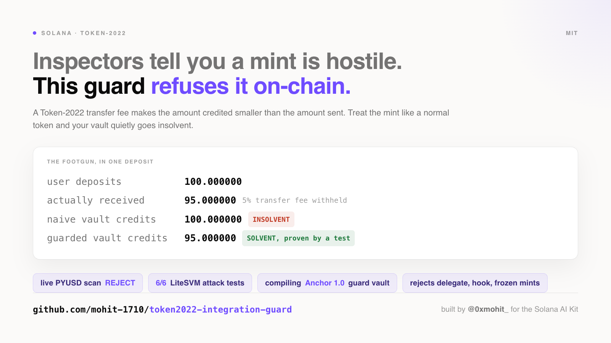
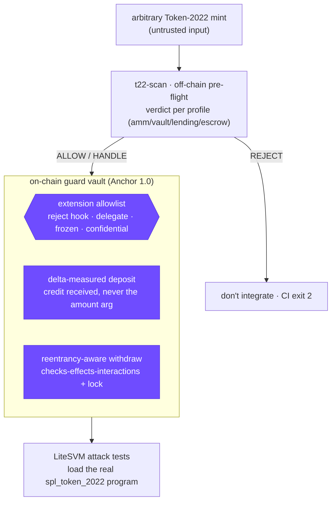
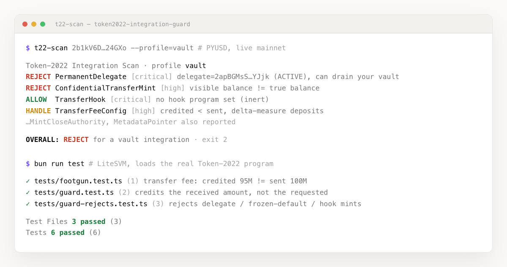

# Token-2022 Integration Guard




> Inspectors tell you a mint is hostile. **This guard refuses it on-chain.** The consumer
> side of Token-2022: how an AMM, vault, lending market, or escrow safely accepts an
> arbitrary, possibly hostile mint without getting drained or bricked. A compiling Anchor
> program you paste into your own protocol, proven by LiteSVM tests that load the real
> Token-2022 program.

---

## The footgun that ships this skill

A Token-2022 transfer fee is withheld from the **recipient**. So the amount your program
*receives* is smaller than the amount the user *sent*. Credit shares on the sent amount and
your vault is instantly insolvent. It is the most common Token-2022 integration bug, and
almost nobody names it.

```
user deposits            100.000000
actually received         95.000000     ← 5% transfer fee withheld
naive vault credits      100.000000     ← INSOLVENT (over-issued 5 shares of nothing)
guarded vault credits     95.000000     ← delta-measured. solvent. proven by a test.
```

That is one of five ways a hostile mint breaks a naive integrator. The others: a **transfer
hook** runs issuer code on every transfer, a **permanent delegate** moves tokens out of your
vault whenever it likes, **default-frozen** accounts are born unusable, and **confidential
transfers** hide the real balance from your accounting. This skill handles all of them.

---

## How it works

Two layers. An off-chain scan as pre-flight, and an on-chain guard as the backstop. The
pieces in **purple** are where the enforcement lives.



The scan is the front door, not a standalone opinion. The same scan that returns `REJECT`
is the pre-flight for a guard that refuses the mint at deposit time.

---

## See it



Scan a live mainnet mint, get a verdict with a real exit code, then watch the guard block
the attacks under LiteSVM. Full runs are committed in [`reports/`](reports/).

---

## What it does

| Area | How |
|---|---|
| **Scan any mint** | [`t22-scan`](tools/t22-scan) reads the mint's TLV extensions and returns `ALLOW / HANDLE / REJECT` for your integration profile, with a CI exit code. Distinguishes **armed vs inert** (an unset hook is `ALLOW`, an active permanent delegate is `REJECT`). |
| **Reject hostile mints on-chain** | The guard reads the mint's extensions inside the program and fails closed on anything not on a small allowlist. Default-deny, so the next extension Solana ships is rejected until you opt in. |
| **Fee-safe deposits** | Credits the **received** delta (`reload()` + balance diff), never the instruction `amount`. Kills the share-insolvency footgun. |
| **Reentrancy-aware withdraw** | Checks-effects-interactions plus a lock flag, so a hook mint can't re-enter the withdraw path. |
| **Prove it** | LiteSVM tests load the real `spl_token_2022` program and assert each guard blocks its attack. |

---

## What it rejects, and why

| Extension | For a vault | Why |
|---|---|---|
| **PermanentDelegate** | `REJECT` | A key can move or burn tokens from your vault at any time. "Mint + freeze revoked" does not make a mint safe. |
| **TransferHook** | `REJECT`* | Issuer code runs on every transfer. Reentrancy, DoS, account injection. (*inert if no program is set) |
| **DefaultAccountState = frozen** | `REJECT` | Your fresh token accounts are born frozen. Deposits silently fail. |
| **ConfidentialTransfer** | `REJECT` | Balances are hidden. Your accounting can't see the real amount. |
| **TransferFeeConfig** | `HANDLE` | Credited is less than sent. Handled by delta-measured deposits. |
| Metadata, ImmutableOwner | `ALLOW` | No transfer-path impact. |

Full matrix and the per-profile splits: [`skill/extension-risk-matrix.md`](skill/extension-risk-matrix.md).

---

## Evidence (live mainnet)

Committed in [`reports/`](reports/), reproducible with the commands below.

| Mint | Program | Verdict (vault) | Driver |
|---|---|---|---|
| **PYUSD** `2b1k…24GXo` | Token-2022 | **REJECT** (exit 2) | active PermanentDelegate + ConfidentialTransfer. Its TransferHook is inert, correctly `ALLOW`. |
| **USDC** `EPjF…Dt1v` | classic SPL | **ALLOW** | no extensions, treated like a normal token. |

---

## Not another Token-2022 "extensions" skill

The strong token-extensions skills in the kit are for the token's **author**: pick
extensions, create the mint, inspect it. This is the **consumer's** side, and it is
complementary. Install it alongside them.

| | Extensions / inspector skills | **This skill (consumer guard)** |
|---|---|---|
| Audience | token **author** | a program that **consumes** a third-party mint |
| Fee handling | prose: "use the net amount" | **enforced** delta-measured deposit + a **tested** insolvency proof |
| "Allowlist" | issuer hook gating which **wallets** may hold the token | consumer guard gating which **mints** it will custody (on-chain) |
| Deliverable | mint inspector + an example issuer hook | a **guard vault** (deposit/withdraw) you drop into your protocol |
| Verdict | "will Phantom / Jupiter / a CEX support it?" | **per-profile** ALLOW/HANDLE/REJECT, wired to on-chain enforcement |

---

## Run

```bash
# scan a mint before you integrate it
cd tools/t22-scan && bun install
bun run scan 2b1kV6DkPAnxd5ixfnxCpjxmKwqjjaYmCZfHsFu24GXo --profile=vault   # → REJECT, exit 2

# build the guard and run the attack tests
cd ../../examples/guard
anchor build --ignore-keys       # builds the .so at the source declare_id (throwaway keypair isn't committed)
bun install
bun run test                     # vitest + LiteSVM → 6 passing
```

Profiles: `amm` · `vault` · `lending` · `escrow` · `generic`. Add `--json` for CI,
`--cluster=devnet` or `--url=<rpc>` to point elsewhere.

Pinned to the 2026 stack: Anchor `1.0`, `anchor-spl 1.0.2`, `@solana/spl-token 0.4.14`,
`litesvm 1.2`. `Cargo.lock` and `bun.lock` are committed.

---

## Install the skill

```bash
./install.sh      # copies skill/ + agents/ + commands/ + rules/ into ~/.claude (or ./.claude with --project)
```

Then ask your agent: *"I'm adding Token-2022 support to my vault, is this mint safe and how do I handle it?"*

---

## What ships

```
token2022-integration-guard/
├── skill/            SKILL.md router → risk matrix, fee accounting, hook/reentrancy,
│                     permanent-delegate/freeze, the on-chain allowlist pattern, scanning, testing
├── agents/           token2022-integration-auditor
├── commands/         /scan-mint, /audit-t22-integration
├── rules/            auto-loaded review rules for token *.rs
├── tools/t22-scan/   the scanner CLI (TypeScript, runnable)
├── examples/guard/   Anchor 1.0 guard program + LiteSVM attack tests
├── reports/          committed live-mainnet scans
└── THREAT_MODEL.md   each attack test mapped to the footgun it closes
```

---

## Threat model & limitations

Each of the 6 attack tests maps to a specific footgun in
[`THREAT_MODEL.md`](THREAT_MODEL.md). Honest non-goals live there too: the scanner reads
**mint-level** extensions (not per-account state, not second-hop hook-authority analysis),
the guard is a **teaching reference** rather than an audited vault, and it is deliberately
**stricter** than the scanner (it fails closed on extension *presence*, because authorities
can be re-armed).

## License

MIT. Free to merge or submodule into the Solana AI Kit.
